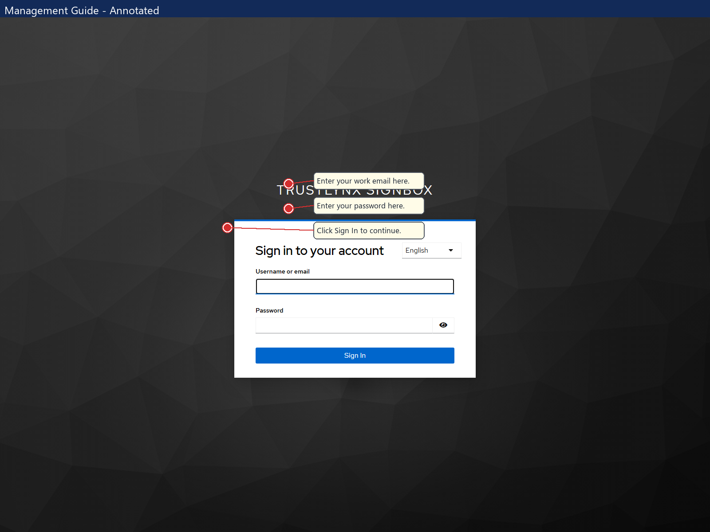
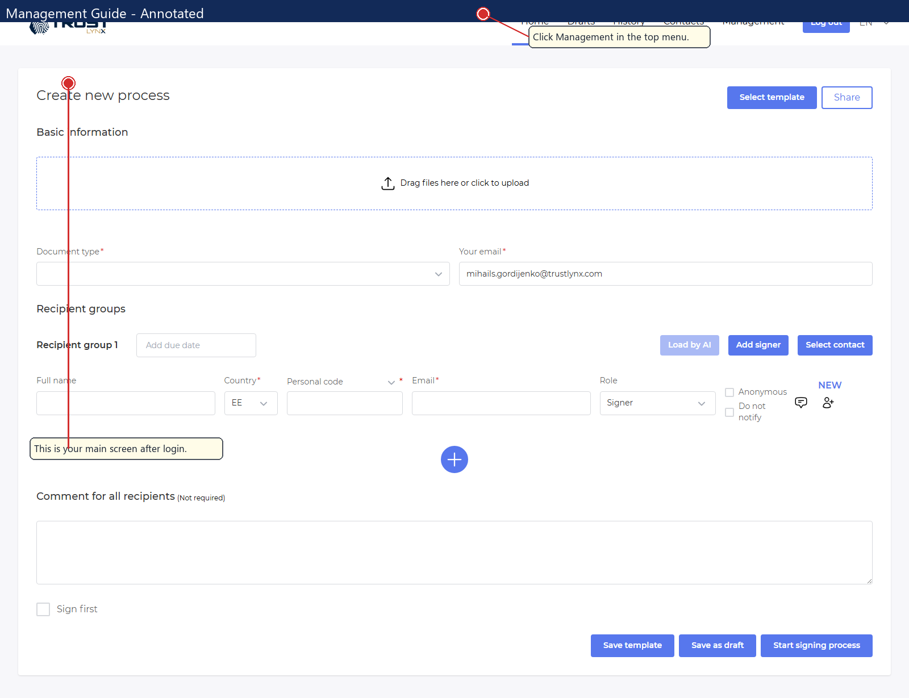
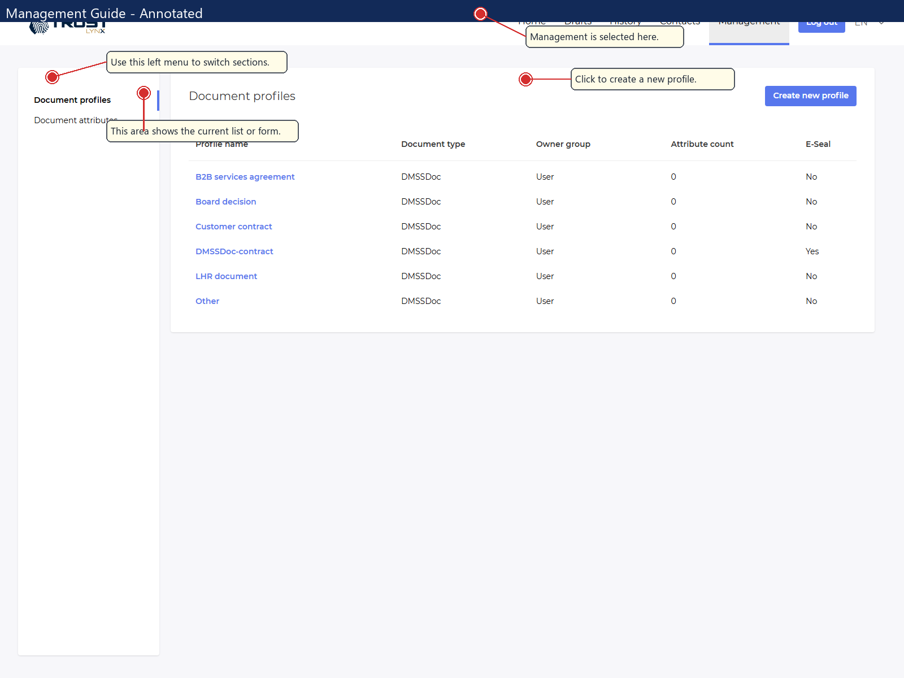
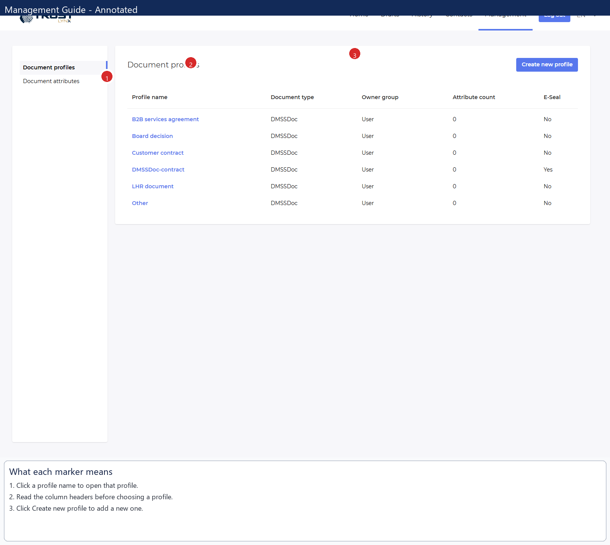
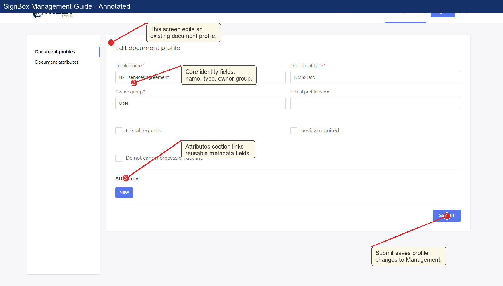
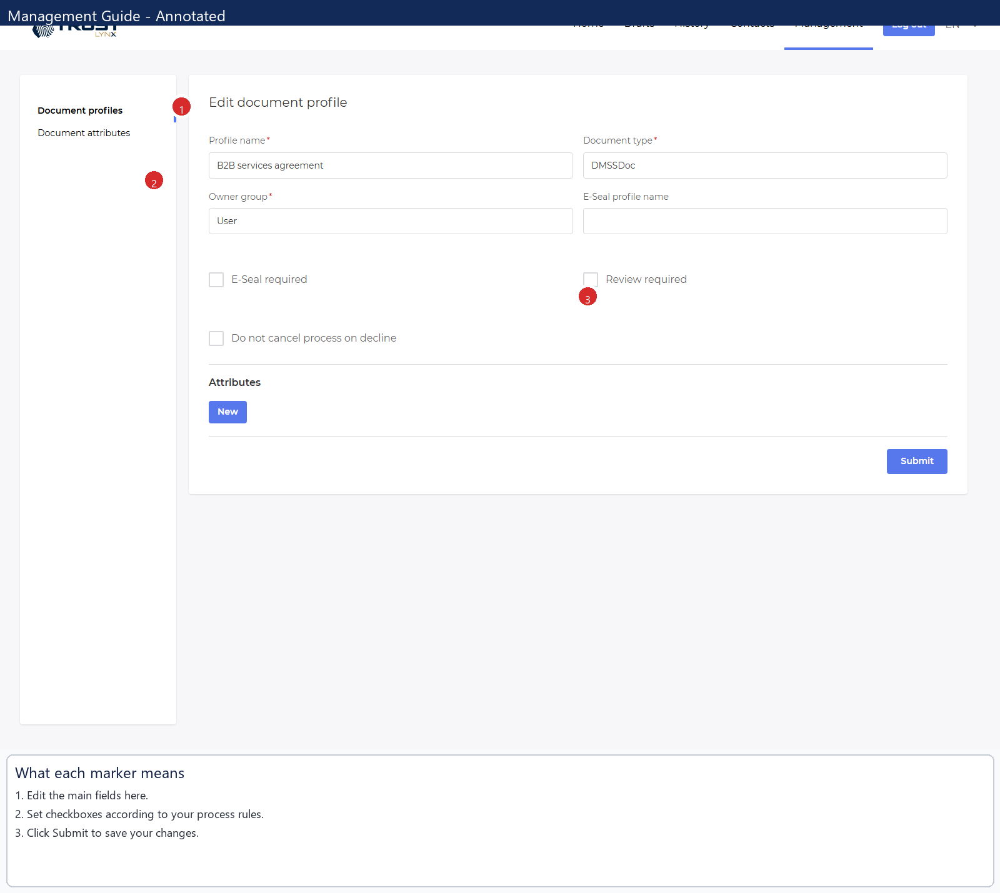
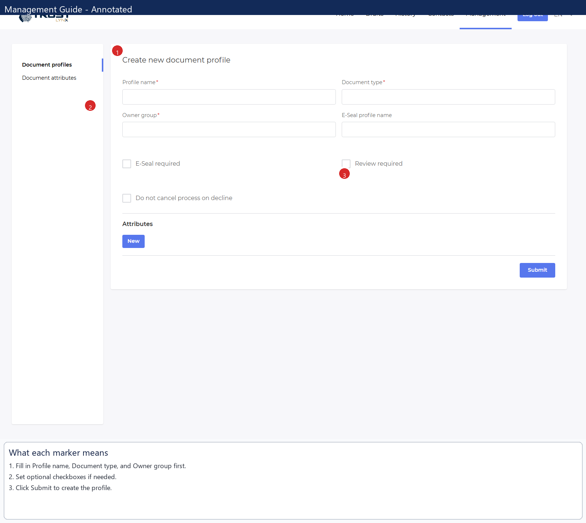
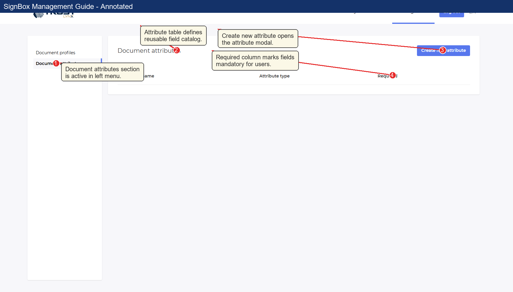
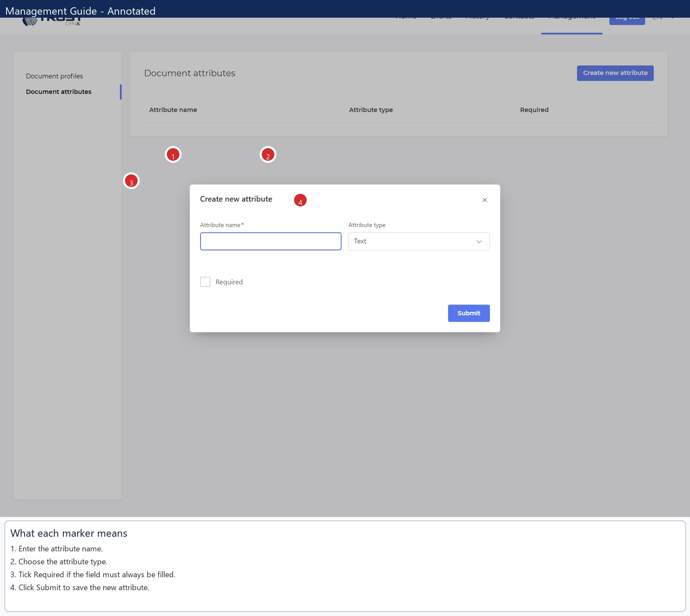

# SignBox Management User Guide

## Who this guide is for

This guide is for first-time and junior users who need to maintain reusable document configuration in SignBox.

## What the Management section does

The **Management** section controls reusable setup data used during process creation:

- **Document profiles** define default behavior for document handling.
- **Document attributes** define reusable data fields (for example, custom metadata fields).

If you are creating or maintaining profile templates, this is the correct section.

## Access and navigation

### Task: Sign in and open Management

**When to use this task:** start of every management session.

**Navigation path:** `SignBox login` -> top menu -> **Management**

**Click path:**
1. Open `https://signbox.trustlynx.com/`.
2. Enter your credentials.
3. Click **Sign In**.
4. In the top menu, click **Management**.

Callouts:
- **1** Username or email field for account identity.
- **2** Password field for secure authentication.
- **3** Language selector before login.
- **4** **Sign In** button to enter the portal.

Callouts:
- **1** Use **Management** in top navigation to open configuration pages.
- **2** This page is process creation, not configuration.
- **3** Workflow action buttons belong to process creation, not Management.

Callouts:
- **1** Top navigation confirms current section.
- **2** Left menu switches between **Document profiles** and **Document attributes**.
- **3** Main title confirms current page.
- **4** Primary button starts creation flow.

## Document profiles

### What this screen is for

Use **Document profiles** to review, create, and modify profile templates used later in signing processes.

### Task: Review profiles in the list

**When to use this task:** before editing, before creating a duplicate profile, and during QA checks.

**Navigation path:** **Management** -> **Document profiles**

Callouts:
- **1** **Profile name** is clickable and opens edit form.
- **2** Column headers are your profile review checklist.
- **3** **Create new profile** starts a blank profile.
- **4** **E-Seal** quickly indicates whether a seal profile is configured.

Important columns:
- **Profile name**: profile identifier used by admins.
- **Document type**: profile category applied in process setup.
- **Owner group**: ownership and maintenance responsibility.
- **Attribute count**: number of linked attributes.
- **E-Seal**: `Yes` or `No` based on seal profile presence.

### Task: Open and update an existing profile

**When to use this task:** when business settings need to be changed on an existing profile.

**Click path:**
1. Click a value in **Profile name**.
2. Review current values.
3. Update needed fields.
4. Click **Submit**.

Callouts:
- **1** Existing profiles open in editable mode.
- **2** Core identity fields: **Profile name**, **Document type**, **Owner group**.
- **3** **Attributes** section links reusable metadata fields.
- **4** **Submit** persists changes.

Callouts:
- **1** **E-Seal profile name**: seal template reference.
- **2** **E-Seal required**: enforces seal behavior.
- **3** **Review required**: requires review workflow.
- **4** **Do not cancel process on decline**: keeps process active when decline occurs.

### Task: Create a new profile

**When to use this task:** when a new document type or workflow variant must be standardized.

**Click path:**
1. In **Document profiles**, click **Create new profile**.
2. Fill required fields.
3. Configure optional behavior.
4. Add attributes if needed.
5. Click **Submit**.
6. Confirm new row appears in the list.

Callouts:
- **1** Page title confirms create mode.
- **2** Required fields must be completed.
- **3** Attributes can be added by **New**.
- **4** **Submit** creates profile and returns to list.

Field meaning and pre-submit check:
- **Profile name**: clear, stable business name.
- **Document type**: exact type expected in business flow.
- **Owner group**: team accountable for updates.
- **E-Seal profile name**: fill when seal profile is part of process policy.
- **E-Seal required**: enable if seal must be enforced.
- **Review required**: enable where review is mandatory.
- **Do not cancel process on decline**: enable only when decline should not terminate process.
- **Before submit**: validate required fields, checkbox logic, and attribute relevance.

## Document attributes

### What this screen is for

Use **Document attributes** to maintain reusable fields that can be linked to profiles.

### Task: Review attribute catalog

**When to use this task:** before creating new attributes or while validating existing field inventory.

**Navigation path:** **Management** -> **Document attributes**

Callouts:
- **1** Left menu confirms **Document attributes** section is active.
- **2** Main table is your reusable attribute catalog.
- **3** **Create new attribute** opens creation modal.
- **4** **Required** column shows whether attribute must be filled.

### Task: Create a new attribute

**When to use this task:** when profile authors need a new reusable metadata field.

**Click path:**
1. Click **Create new attribute**.
2. Enter **Attribute name**.
3. Select **Attribute type**.
4. Set **Required** if mandatory.
5. Click **Submit**.

Callouts:
- **1** Modal title confirms create action.
- **2** **Attribute name** should be business-understandable.
- **3** **Attribute type** controls how users provide values.
- **4** **Required** makes the field mandatory.
- **5** **Submit** saves and closes modal.

Attribute field guidance:
- **Attribute name**: short, unique, meaningful.
- **Attribute type**: choose input behavior that fits real data (`Text`, `Datetime`, `Checkbox`).
- **Required**: enable only when missing data should block completion.

## Common mistakes and recovery

- **Editing wrong section**: verify left menu selection before changes.
- **Skipping list review before create**: check existing profiles/attributes first to avoid duplicates.
- **Incorrect checkbox policy**: review workflow implications before enabling profile options.
- **Unclear names**: rename using business language and retry submit.
- **Unexpected result after submit**: return to list and confirm row values; reopen and correct if needed.

## Screenshot index

- `docs/images/management/annotated/01-login-page-annotated.png`
- `docs/images/management/annotated/02-post-login-home-annotated.png`
- `docs/images/management/annotated/03-management-overview-annotated.png`
- `docs/images/management/annotated/04-document-profiles-list-annotated.png`
- `docs/images/management/annotated/05-document-profiles-detail-annotated.png`
- `docs/images/management/annotated/06-document-profiles-edit-annotated.png`
- `docs/images/management/annotated/07-document-profiles-create-form-annotated.png`
- `docs/images/management/annotated/08-document-attributes-list-annotated.png`
- `docs/images/management/annotated/09-document-attributes-create-form-annotated.png`
